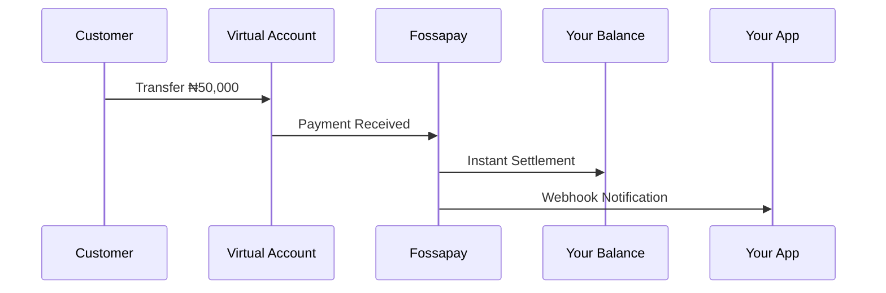

## What is Settlement?

Settlement is the process of transferring collected funds from virtual accounts and other payment channels to your designated bank account or wallet. Fossapay offers flexible settlement options to match your business needs.

<Info>
  Choose between instant settlement for immediate access to funds or scheduled settlement for better cash flow management.
</Info>

## Settlement Types

### Instant Settlement

Funds are automatically transferred to your balance immediately when a payment is received.

**Benefits:**
- Immediate access to funds
- Real-time liquidity
- No waiting period
- Better for high-volume businesses

**How it works:**


### Scheduled Settlement

Funds are batched and settled at predetermined intervals (daily, weekly, or custom).

**Benefits:**
- Predictable cash flow
- Reduced transaction fees
- Easier bulk reconciliation
- Float management

**Available Schedules:**
- **T+0** - Same day settlement (default: 6 PM daily)
- **T+1** - Next business day
- **Weekly** - Every Friday
- **Custom** - Define your own schedule

### Manual Settlement

You control when settlements occur through the dashboard or API.

**Use cases:**
- Reserve management
- Liquidity planning
- Complex reconciliation needs

## Settlement Configuration

### Setting Up Instant Settlement

```javascript
await fossapay.settings.updateSettlement({
  type: 'instant',
  destination: {
    type: 'wallet', // or 'bank_account'
    wallet_id: 'wal_main_001'
  },
  currencies: ['NGN', 'USDT']
});
```

### Setting Up Scheduled Settlement

```javascript
await fossapay.settings.updateSettlement({
  type: 'scheduled',
  schedule: 'daily',
  settlement_time: '18:00', // 6 PM WAT
  destination: {
    type: 'bank_account',
    account_number: '0123456789',
    bank_code: '058',
    account_name: 'Acme Corporation'
  },
  minimum_amount: 10000 // Only settle if balance >= ₦10,000
});
```

## Settlement Destinations

### Wallet Settlement
Settle funds to your Fossapay wallet for instant access.

```json
{
  "destination": {
    "type": "wallet",
    "wallet_id": "wal_main_001"
  }
}
```

**Advantages:**
- Instant availability
- Use for payouts without withdrawal
- Multi-currency support
- No settlement fees

### Bank Account Settlement
Settle funds directly to your bank account.

```json
{
  "destination": {
    "type": "bank_account",
    "account_number": "0123456789",
    "bank_code": "058",
    "account_name": "Acme Corporation"
  }
}
```

**Advantages:**
- Direct access to funds
- Traditional banking integration
- Simpler accounting

### Split Settlement
Distribute funds across multiple destinations automatically.

```json
{
  "destination": {
    "type": "split",
    "splits": [
      {
        "type": "wallet",
        "wallet_id": "wal_operating",
        "percentage": 80
      },
      {
        "type": "wallet",
        "wallet_id": "wal_reserve",
        "percentage": 20
      }
    ]
  }
}
```

## Settlement Fees

| Settlement Type | Fee |
|----------------|-----|
| Instant to Wallet | Free |
| Scheduled to Wallet | Free |
| Instant to Bank Account | ₦50 per transaction |
| Scheduled to Bank Account | ₦25 per batch |
| Manual Settlement | ₦50 per transaction |

<Note>
  Fees are deducted from the settlement amount automatically.
</Note>

## Settlement Limits

| Parameter | Limit |
|-----------|-------|
| Minimum settlement | ₦100 |
| Maximum per transaction | ₦5,000,000 |
| Daily settlement limit | ₦50,000,000 |
| Settlements per day | Unlimited |

<Warning>
  Limits may vary based on your business verification level. Contact support for higher limits.
</Warning>

## Reconciliation

### Settlement Reports

Access detailed settlement reports via the dashboard or API:

```javascript
const report = await fossapay.settlements.getReport({
  start_date: '2024-01-01',
  end_date: '2024-01-31',
  format: 'json' // or 'csv', 'pdf'
});
```

**Report Contents:**
```json
{
  "period": {
    "start": "2024-01-01T00:00:00Z",
    "end": "2024-01-31T23:59:59Z"
  },
  "summary": {
    "total_collections": 5000000,
    "total_fees": 12500,
    "total_settled": 4987500,
    "transaction_count": 250
  },
  "settlements": [
    {
      "settlement_id": "stl_abc123",
      "amount": 500000,
      "fee": 50,
      "net_amount": 499950,
      "destination": "0123456789",
      "status": "completed",
      "settled_at": "2024-01-15T18:00:00Z",
      "transactions": [
        {
          "transaction_id": "txn_001",
          "amount": 50000,
          "customer": "John Doe",
          "reference": "ref_001",
          "received_at": "2024-01-15T10:30:00Z"
        }
      ]
    }
  ]
}
```

### Transaction Matching

Match settlements to original transactions:

```javascript
const settlement = await fossapay.settlements.get('stl_abc123');

// Get all transactions in this settlement
const transactions = await fossapay.settlements.getTransactions({
  settlement_id: 'stl_abc123'
});
```

### Reconciliation Best Practices

<AccordionGroup>
  <Accordion title="Daily Reconciliation">
    Reconcile settlements daily even if you use scheduled settlement:
    ```javascript
    // Run daily reconciliation
    const today = new Date();
    const report = await fossapay.settlements.getReport({
      start_date: today.toISOString(),
      end_date: today.toISOString()
    });

    // Match with your internal records
    await matchTransactions(report);
    ```
  </Accordion>

  <Accordion title="Use Webhook Events">
    Listen to settlement webhooks for automatic reconciliation:
    ```javascript
    app.post('/webhooks/fossapay', (req, res) => {
      const { event, data } = req.body;

      if (event === 'settlement.completed') {
        // Trigger reconciliation
        reconcileSettlement(data.settlement_id);
      }
    });
    ```
  </Accordion>

  <Accordion title="Store Settlement IDs">
    Always store settlement IDs alongside transaction records:
    ```sql
    UPDATE transactions
    SET settlement_id = 'stl_abc123',
        settled_at = '2024-01-15 18:00:00'
    WHERE transaction_id IN (SELECT transaction_id FROM settlement_transactions);
    ```
  </Accordion>

  <Accordion title="Handle Disputes Quickly">
    Monitor failed settlements and resolve issues promptly:
    ```javascript
    const failed = await fossapay.settlements.list({
      status: 'failed',
      start_date: last7Days
    });

    for (const settlement of failed.data) {
      await investigateFailure(settlement);
    }
    ```
  </Accordion>
</AccordionGroup>

## Settlement Status

Settlements go through these statuses:

| Status | Description |
|--------|-------------|
| `pending` | Settlement initiated but not processed |
| `processing` | Being processed by bank |
| `completed` | Successfully settled |
| `failed` | Settlement failed (funds returned) |
| `reversed` | Settlement reversed after completion |

### Checking Settlement Status

```javascript
const settlement = await fossapay.settlements.get('stl_abc123');

console.log(settlement.status);
// "completed"
```

### Webhook Events

```javascript
// Settlement webhook events
{
  "event": "settlement.pending",
  "data": {
    "settlement_id": "stl_abc123",
    "amount": 500000,
    "destination": "0123456789"
  }
}

{
  "event": "settlement.completed",
  "data": {
    "settlement_id": "stl_abc123",
    "amount": 500000,
    "completed_at": "2024-01-15T18:05:23Z"
  }
}

{
  "event": "settlement.failed",
  "data": {
    "settlement_id": "stl_abc123",
    "amount": 500000,
    "reason": "Invalid account number"
  }
}
```

## Reserve Management

Set aside a percentage of collections as reserves:

```javascript
await fossapay.settings.updateReserve({
  enabled: true,
  percentage: 10, // Hold 10% of collections
  wallet_id: 'wal_reserve_001',
  release_schedule: 'monthly' // Release reserves monthly
});
```

**Use cases:**
- Chargeback protection
- Refund reserves
- Compliance requirements
- Cash flow management

## Failed Settlements

Handle failed settlements gracefully:

```javascript
// Listen for failed settlement webhook
app.post('/webhooks/fossapay', (req, res) => {
  const { event, data } = req.body;

  if (event === 'settlement.failed') {
    // Log failure
    logger.error('Settlement failed', {
      settlement_id: data.settlement_id,
      reason: data.reason
    });

    // Update destination and retry
    await fossapay.settlements.retry(data.settlement_id, {
      destination: {
        type: 'bank_account',
        account_number: 'backup_account'
      }
    });
  }
});
```

## Manual Settlement Triggers

Trigger settlements manually when needed:

```javascript
// Settle all pending collections
const settlement = await fossapay.settlements.create({
  amount: 'all', // or specific amount
  destination: {
    type: 'bank_account',
    account_number: '0123456789',
    bank_code: '058'
  },
  narration: 'Manual settlement - January 2024'
});
```

## Settlement Calendar

Non-settlement days:
- Saturdays and Sundays
- Nigerian public holidays
- Bank holidays

<Note>
  Scheduled settlements queued on non-settlement days will be processed on the next business day.
</Note>

## Next Steps

<CardGroup cols={2}>
  <Card title="Configure Settlement" icon="gear" href="https://dashboard.fossapay.com/settings/settlement">
    Set up your settlement preferences
  </Card>
  <Card title="Reconciliation Guide" icon="book" href="/guides/reconciliation">
    Learn best practices for reconciliation
  </Card>
  <Card title="Webhooks" icon="webhook" href="/concepts/webhooks">
    Handle settlement events
  </Card>
  <Card title="View Settlements" icon="list" href="https://dashboard.fossapay.com/settlements">
    Access settlement history
  </Card>
</CardGroup>
