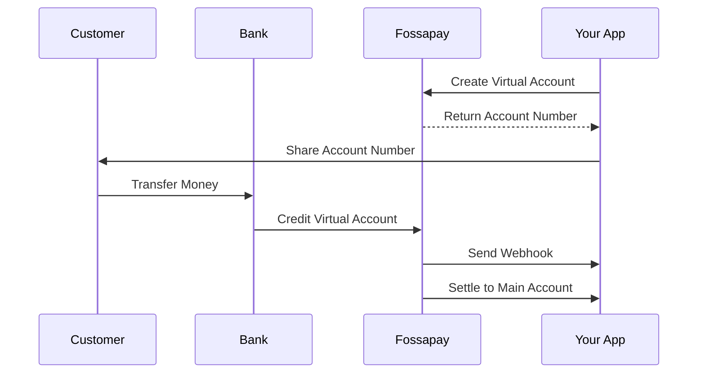

## What are Virtual Accounts?

Virtual accounts are unique bank account numbers that you can generate on-demand for your customers. Each virtual account is tied to your main settlement account but appears as a unique account number to your customers.

<Info>
  Virtual accounts enable you to accept payments without requiring customers to specify reference codes, making collections seamless and automatic.
</Info>

## Key Benefits

<CardGroup cols={2}>
  <Card title="Automatic Reconciliation" icon="check-double">
    Each customer gets a unique account number, so payments are automatically matched to the right customer.
  </Card>
  <Card title="Better User Experience" icon="smile">
    Customers just transfer to their account number - no reference codes needed.
  </Card>
  <Card title="Instant Notifications" icon="bell">
    Get real-time webhooks whenever a payment is received.
  </Card>
  <Card title="Unlimited Creation" icon="infinity">
    Create as many virtual accounts as you need at no extra cost.
  </Card>
</CardGroup>

## How Virtual Accounts Work



## Virtual Account Types

### Dedicated Virtual Accounts

Permanent account numbers assigned to specific customers. Best for:
- Long-term customer relationships
- Subscription businesses
- Wallets and balance top-ups
- Regular collections

```json
{
  "type": "dedicated",
  "customer_name": "John Doe",
  "customer_email": "john@example.com",
  "customer_phone": "+2348012345678"
}
```

### Temporary Virtual Accounts

Short-lived account numbers for one-time or time-limited payments. Best for:
- Invoice payments
- E-commerce checkouts
- Event tickets
- Time-sensitive collections

```json
{
  "type": "temporary",
  "customer_name": "Jane Smith",
  "expires_at": "2024-01-31T23:59:59Z",
  "amount": 50000
}
```

## Virtual Account Lifecycle

<Steps>
  <Step title="Creation">
    Generate a virtual account via the API or dashboard
  </Step>
  <Step title="Active">
    Account is ready to receive payments
  </Step>
  <Step title="Payment Received">
    Customer transfers money to the account
  </Step>
  <Step title="Settlement">
    Funds are settled to your main account (instant or scheduled)
  </Step>
  <Step title="Expiry (Optional)">
    Temporary accounts expire after the set duration
  </Step>
</Steps>

## Settlement Options

Choose how you want to receive funds from virtual account payments:

### Instant Settlement
Funds are immediately transferred to your main balance upon payment receipt.

**Pros:**
- Immediate access to funds
- Real-time liquidity
- No waiting period

**Cons:**
- No float period
- Immediate reconciliation required

### Scheduled Settlement
Funds are batched and settled at specific intervals (daily, weekly, etc.)

**Pros:**
- Better cash flow management
- Reduced transaction fees
- Easier bulk reconciliation

**Cons:**
- Delayed access to funds
- Working capital tied up

## Account Naming

Fossapay supports custom account names for better branding:

```json
{
  "account_name": "ACME Corp - John Doe",
  "business_name": "ACME Corporation"
}
```

<Note>
  Account names appear on your customer's bank statement when they transfer money.
</Note>

## Virtual Account Metadata

Store custom data with each virtual account for easier tracking:

```json
{
  "customer_id": "cus_abc123",
  "metadata": {
    "user_id": "12345",
    "subscription_plan": "premium",
    "department": "sales",
    "campaign": "q1-promo"
  }
}
```

## Supported Banks

Virtual accounts are currently available for these banks:

- **Wema Bank** - Primary provider
- **Sterling Bank** - Coming soon
- **Providus Bank** - Coming soon

<Tip>
  Regardless of the provider bank, customers can transfer from ANY Nigerian bank to your virtual accounts.
</Tip>

## Limits and Restrictions

| Feature | Limit |
|---------|-------|
| Accounts per business | Unlimited |
| Minimum amount | ₦100 |
| Maximum single transaction | ₦5,000,000 |
| Daily transaction limit | ₦50,000,000 |
| Account creation rate | 100 per minute |

<Warning>
  Limits may vary based on your business verification level. Contact support for higher limits.
</Warning>

## Best Practices

<AccordionGroup>
  <Accordion title="Use Meaningful Names">
    Include customer identifiers in account names for easy reconciliation:
    ```
    "YourBrand - Customer Name"
    ```
  </Accordion>

  <Accordion title="Store Metadata">
    Always include relevant metadata to track accounts:
    ```json
    {
      "metadata": {
        "customer_id": "internal_id_123",
        "created_by": "user_456"
      }
    }
    ```
  </Accordion>

  <Accordion title="Handle Webhooks Properly">
    - Verify webhook signatures
    - Respond with 200 status quickly
    - Process transactions asynchronously
    - Implement idempotency
  </Accordion>

  <Accordion title="Set Expiry for One-Time Payments">
    For invoice payments, set an expiry date:
    ```json
    {
      "expires_at": "2024-12-31T23:59:59Z"
    }
    ```
  </Accordion>
</AccordionGroup>

## Common Use Cases

### Wallet Top-ups
```javascript
// Create a dedicated account for each user
const account = await fossapay.virtualAccounts.create({
  type: 'dedicated',
  customer_name: user.fullName,
  customer_email: user.email,
  metadata: {
    user_id: user.id,
    purpose: 'wallet_topup'
  }
});

// Show account number to user
// When they transfer, webhook fires and you credit their wallet
```

### Invoice Payments
```javascript
// Create temporary account for invoice
const account = await fossapay.virtualAccounts.create({
  type: 'temporary',
  customer_name: invoice.customerName,
  amount: invoice.amount,
  expires_at: invoice.dueDate,
  metadata: {
    invoice_id: invoice.id
  }
});
```

### Subscription Collections
```javascript
// Create account once, reuse for recurring payments
const account = await fossapay.virtualAccounts.create({
  type: 'dedicated',
  customer_name: subscriber.name,
  metadata: {
    subscription_id: subscription.id,
    plan: 'monthly'
  }
});
```

## Next Steps

<CardGroup cols={2}>
  <Card title="Create Virtual Account" icon="code" href="/api-reference/collections/create-virtual-account">
    Learn how to create virtual accounts via API
  </Card>
  <Card title="Collections Guide" icon="book" href="/guides/collections">
    Complete guide to accepting payments
  </Card>
  <Card title="Webhooks" icon="webhook" href="/concepts/webhooks">
    Handle payment notifications
  </Card>
  <Card title="Settlements" icon="money-bill-transfer" href="/concepts/settlements">
    Understand settlement options
  </Card>
</CardGroup>
