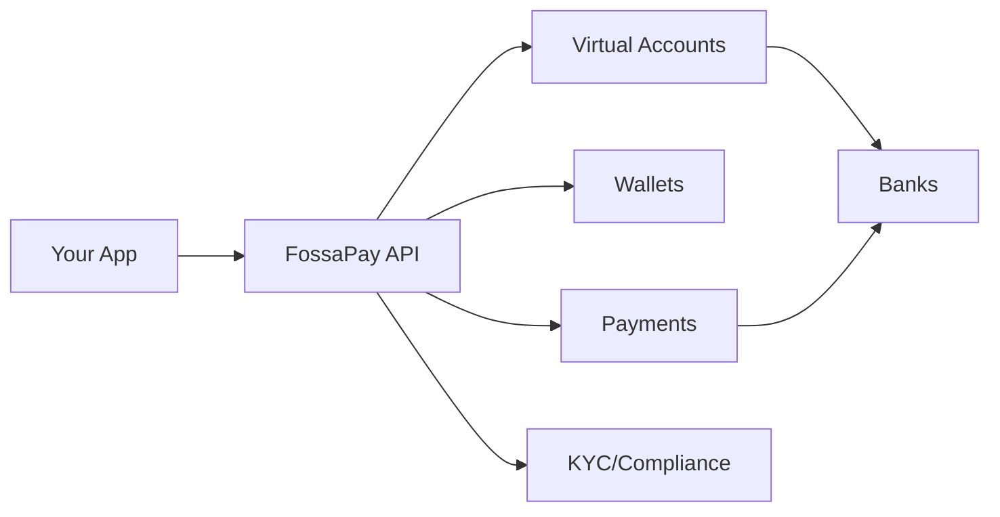

## Launch Your Own Neobank

FossaPay's white-label solution enables you to launch a fully-branded neobank or fintech platform using our banking infrastructure. Focus on your customers and growth while we handle the backend, compliance, and banking operations.

<Info>
  **Launch Timeline:** Go live in 2 months with our white-label solution
</Info>

## What's Included

<CardGroup cols={2}>
  <Card color="#0080FF" title="Virtual Accounts & Wallets" icon="wallet">
    Complete banking infrastructure ready to use
  </Card>
  <Card color="#0080FF" title="KYC & Compliance" icon="shield-check">
    Built-in KYC flows and regulatory compliance
  </Card>
  <Card color="#0080FF" title="Payouts & Collections" icon="money-bill-transfer">
    Full payment processing capabilities
  </Card>
  <Card color="#0080FF" title="Developer Support" icon="code">
    Dedicated technical support and sandbox access
  </Card>
</CardGroup>

## Use Cases

### Digital Banks (Neobanks)

Launch a full-featured digital bank:
- Customer wallet accounts
- Virtual account numbers for each customer
- Debit cards (coming soon)
- P2P transfers
- Bill payments
- Savings & investment features

**Example Brands:** Kuda, Carbon, FairMoney

### Embedded Finance

Embed banking into your existing platform:
- E-commerce platforms offering seller wallets
- Gig economy apps with instant payouts
- SaaS platforms with payment processing
- Marketplaces with split payments

**Example:** Shopify Balance, Uber Money

### B2B Fintech

Build financial products for businesses:
- Business expense cards
- Payroll automation
- Invoice financing
- Treasury management

**Example:** Brex, Ramp

### Crypto-to-Fiat Bridge

Bridge cryptocurrency and traditional banking:
- Fiat on/off ramps
- Stablecoin wallets
- Crypto trading integration
- Cross-border payments

## What You Control

### Full Branding
- Your brand name and logo
- Custom color schemes
- Branded account names
- White-labeled communications

### Customer Experience
- Your app or web platform
- Custom user flows
- Personalized features
- Your customer support

### Pricing & Monetization
- Set your own fees
- Design pricing tiers
- Revenue sharing models
- Subscription plans

## What We Provide

### Banking Infrastructure
- Virtual account issuance
- Multi-currency wallets (NGN, USDT, USDC)
- Payment processing
- Settlement systems
- Ledger management

### Compliance & Security
- KYC/AML systems
- PCI-DSS compliance
- NDPR compliance
- CBN regulatory compliance
- Fraud detection

### Operations & Support
- 24/7 technical support
- Dedicated account manager
- Regular platform updates

<Note>
  Contact our sales team for custom pricing based on your expected volume and requirements.
</Note>

## Technical Architecture

Your application integrates with FossaPay APIs, and we handle all banking operations, compliance, and settlements.

## Getting Started

<Steps>
  <Step title="Initial Consultation">
    Schedule a call with our team to discuss your requirements
  </Step>

  <Step title="Technical Integration">
    Our team helps you integrate the APIs and set up your sandbox
  </Step>

  <Step title="Compliance Setup">
    Complete business verification and regulatory requirements
  </Step>

  <Step title="Testing & QA">
    Test all features in sandbox with our support
  </Step>

  <Step title="Go Live">
    Launch your branded platform to customers
  </Step>
</Steps>

## Regulatory Benefits

By using FossaPay's white-label solution:
- ✅ Leverage our regulatory approvals
- ✅ Built-in KYC/AML compliance
- ✅ Automated regulatory reporting
- ✅ Stay compliant with CBN regulations

## Next Steps

<CardGroup cols={2}>
  <Card color="#0080FF" title="Setup Guide" icon="rocket" href="/white-label/setup">
    Learn how to set up your white-label platform
  </Card>
  <Card color="#0080FF" title="Customization" icon="palette" href="/white-label/customization">
    Customize your branding and features
  </Card>
  <Card color="#0080FF" title="Contact Sales" icon="phone" href="mailto:sales@fossapay.com">
    Schedule a consultation
  </Card>
  <Card color="#0080FF" title="View Demo" icon="display" href="https://demo.fossapay.com">
    See a live demo
  </Card>
</CardGroup>

## FAQs

<AccordionGroup>
  <Accordion title="Do I need a banking license?">
    No, you don't need your own banking license. You operate under FossaPay's regulatory framework.
  </Accordion>

  <Accordion title="Can I set my own transaction fees?">
    Yes, you can set your own fees and pricing for your customers. FossaPay charges you a wholesale rate.
  </Accordion>

  <Accordion title="What currencies are supported?">
    Currently NGN, USDT, and USDC. More currencies coming soon.
  </Accordion>

  <Accordion title="Can I issue physical debit cards?">
    Card issuance is coming Q2 2024. Contact sales for early access.
  </Accordion>

  <Accordion title="What's the minimum volume requirement?">
    No minimum for the revenue share model. Platform fee models may have minimums - contact sales for details.
  </Accordion>
</AccordionGroup>

## Contact Us

Ready to launch your neobank?

- **Email**: product@fossapay.com
- **Phone**: +2347088899861
- **Schedule**: [Book a demo](https://calendly.com/codewithmide/new-meeting)
